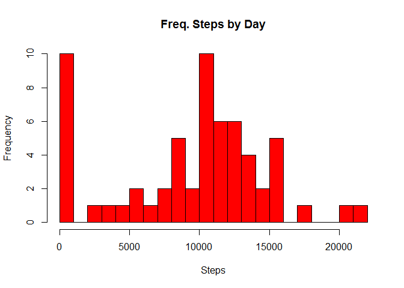
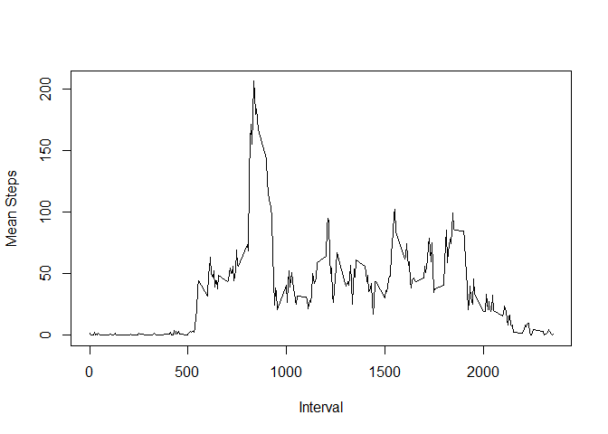
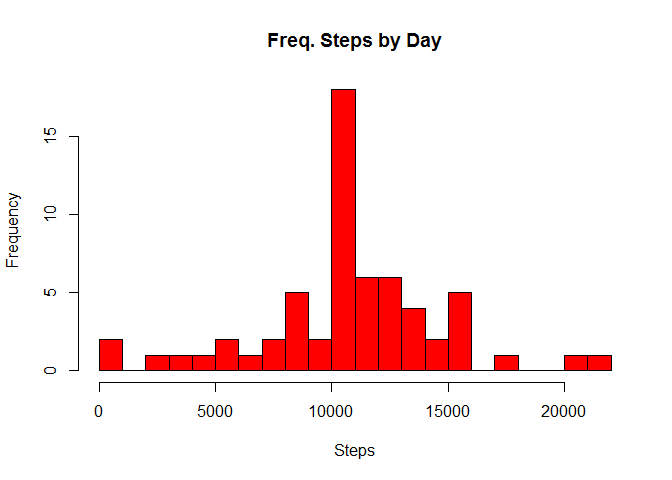

# Reproducible Research: Peer Assessment 1


```r
library(dplyr)
```

```
## Warning: package 'dplyr' was built under R version 3.1.2
```


## Loading and preprocessing the data

If the file .csv doesn't exist in the repository directory, unzip the zip file. 


```r
library(dplyr)
if (!file.exists("activity.csv")){
    unzip("activity.zip")
    unlink("activity.zip")
}
data <- read.csv("activity.csv")
data <- tbl_df(data)
```

## What is mean total number of steps taken per day?
Group the steps by date


```r
grouped <- group_by(data, date)
summarisegrouped <- summarise(grouped, sum(steps,na.rm = TRUE))
colnames(summarisegrouped) <- c("date", "steps")
```


This is a histogram of the total number of steps taken each day

```r
hist(summarisegrouped$steps, breaks=30, col = "red", xlab = "Steps", main = "Freq. Steps by Day")
```

 

The mean and the median of total number of steps taken per day are:


```r
mean(summarisegrouped$steps)
```

```
## [1] 9354.23
```

```r
median(summarisegrouped$steps)
```

```
## [1] 10395
```


## What is the average daily activity pattern?

In this part, I group the data by interval using the dplyr package. Then plot the data with the mean of steps by interval.


```r
grouped_by_interval <- group_by(data, interval)
summarisegroupedbyinterval <- summarise(grouped_by_interval, mean(steps,na.rm = TRUE))
colnames(summarisegroupedbyinterval) <- c("interval", "steps")

plot(summarisegroupedbyinterval$interval, summarisegroupedbyinterval$steps, type="l", xlab = "Interval", ylab = "Mean Steps")
```

 


Which 5-minute interval, on average across all the days in the dataset, contains the maximum number of steps?


```r
summarisegroupedbyinterval[which.max(summarisegroupedbyinterval$steps),]
```

```
## Source: local data frame [1 x 2]
## 
##   interval    steps
## 1      835 206.1698
```


## Imputing missing values

Calculate and report the total number of missing values in the dataset (i.e. the total number of rows with NAs)


```r
sum(is.na(data$steps))
```

```
## [1] 2304
```

Devise a strategy for filling in all of the missing values in the dataset. The strategy does not need to be sophisticated. For example, you could use the mean/median for that day, or the mean for that 5-minute interval, etc.

I will create a new data equal the the original, but replacing the missing data with the mean of the interval.


```r
new_data <- data
new_data <- tbl_df(new_data)

for (i in 1:nrow(new_data)){
    if (is.na(new_data[i,]$steps)) {
        interval_replace <- new_data[i,]$interval
        new_data[i,]$steps <- summarisegroupedbyinterval[summarisegroupedbyinterval$interval == interval_replace,]$steps
    }
}
```


Make a histogram of the total number of steps taken each day and Calculate and report the mean and median total number of steps taken per day.


```r
new_grouped <- group_by(new_data, date)
new_summarisegrouped <- summarise(new_grouped, sum(steps,na.rm = TRUE))
colnames(new_summarisegrouped) <- c("date", "steps")

hist(new_summarisegrouped$steps, breaks=30, col = "red", xlab = "Steps", main = "Freq. Steps by Day")
```

 


Do these values differ from the estimates from the first part of the assignment?

The major impact is that the "0 steps" value is re-distribuited

What is the impact of imputing missing data on the estimates of the total daily number of steps?


```r
mean(new_summarisegrouped$steps)
```

```
## [1] 10766.19
```

```r
median(new_summarisegrouped$steps)
```

```
## [1] 10766.19
```


## Are there differences in activity patterns between weekdays and weekends?

For this part the weekdays() function may be of some help here. Use the dataset with the filled-in missing values for this part.

Create a new factor variable in the dataset with two levels -- "weekday" and "weekend" indicating whether a given date is a weekday or weekend day.


```r
new_data$date <- as.Date(new_data$date)

new_data <- transform(new_data, weekend= ifelse(as.POSIXlt(new_data$date, format='%m/%d/%Y')$wday %in% c(0, 6), "weekend", "weekday"))
```


Make a panel plot containing a time series plot (i.e. type = "l") of the 5-minute interval (x-axis) and the average number of steps taken, averaged across all weekday days or weekend days (y-axis). 


```r
library(lattice)
grouped_by_interval_day <- group_by(new_data, weekend, interval)
summarisegroupedbyinterval_day <- summarise(grouped_by_interval_day, mean(steps,na.rm = TRUE))

colnames(summarisegroupedbyinterval_day) <- c("weekend","interval", "steps")

xyplot(steps ~ interval | weekend, data = summarisegroupedbyinterval_day, layout = c(1,2), type = "l")
```

 

